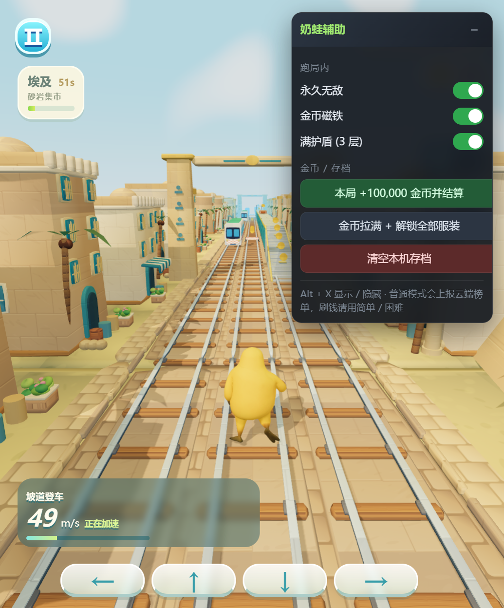

# 奶蛙快跑 · 辅助面板

> 一个 Tampermonkey 用户脚本，为 [奶蛙快跑](https://naiwa-kuaipao.pages.dev/)（自研 three.js 无限跑酷）加上**纯前端**的本地辅助功能：永久无敌、金币磁铁、满护盾、一键刷金币、解锁全部 73 套服装。



---

## ⚠️ 免责声明

本脚本**仅供前端逆向学习与个人离线娱乐**使用。请先读完再安装：

- **不要用来污染云端排行榜。** 游戏的「普通模式」会把本局最远距离上报到公开榜单。脚本默认把这个场景排除在外——刷金币请切到「简单 / 困难」模式（实测全程 0 次 `/api/` 请求，纯本地）。
- **金币和服装是作者的变现内容。** 作者是个人开发者（游戏内「加入我们」有 QQ 邮箱和抖音号）。如果玩得开心，建议支持一下。
- 本脚本修改的是**你自己浏览器里**的客户端状态，不涉及任何服务端漏洞，也不影响其他玩家。使用产生的任何后果由使用者自行承担。

## 功能

| 区域 | 项目 | 说明 |
| --- | --- | --- |
| 跑局内 | 永久无敌 | 永不掉血、永不被牛来/猎犬抓住，可实时开关 |
| | 金币磁铁 | 自动吸附附近金币，可实时开关 |
| | 满护盾 | 保持 3 层护盾（`CONFIG.maxShields`），可实时开关 |
| 金币 / 存档 | 本局 +100,000 并结算 | 走游戏自己的 `bankRun()` 写入钱包，**不需要刷新页面** |
| | 金币拉满 + 解锁全部服装 | 直改存档：99,999,999 金币 + 73 套服装，自动刷新生效 |
| | 清空本机存档 | 一键还原成全新游客状态 |

面板右上角 `–` 可折叠，键盘 `Alt + X` 显示 / 隐藏。

## 安装

1. 给浏览器安装 [Tampermonkey](https://www.tampermonkey.net/)（油猴）扩展。
2. 打开 Tampermonkey 面板 → **添加新脚本**。
3. 清空编辑器里的模板，把 [`naiwa-helper.user.js`](naiwa-helper.user.js) 的内容整段粘贴进去。
4. `Ctrl + S` 保存。
5. 打开 <https://naiwa-kuaipao.pages.dev/>，右上角就会出现面板。

> 手动安装没有自动更新。想启用自动更新，在脚本头部补上两行（把 `USER/REPO` 换成你的仓库）：
>
> ```js
> // @downloadURL  https://raw.githubusercontent.com/USER/REPO/main/naiwa-helper.user.js
> // @updateURL    https://raw.githubusercontent.com/USER/REPO/main/naiwa-helper.user.js
> ```

## 使用

1. 选难度（**刷金币请用「简单」或「困难」**），点「点击开跑」。
2. 默认三个开关都是开的，直接跑就行。
3. 想让金币进钱包，在跑动中点面板上的「本局 +100,000 金币并结算」——它会调用游戏自己的结算流程，然后自动回到车站。
4. 想一次性把商城的服装全部拿下，点「金币拉满 + 解锁全部服装」，页面会自动刷新。

## 工作原理

游戏把每帧的状态机放在 `RunnerCore.Game` 里，碰撞与受伤只有两个入口：

```js
// step() 碰撞判定
if (!safe && this.invincible <= 0) { o.hit = true; this.hit(); ... }

// hit() 受伤判定
hit() {
  if (this.invincible > 0) return;                      // 直接短路
  if (this.shield > 0) { this.shield--; ... return; }
  if (this.hurt > 0) { this.status = "over"; }           // 第一次撞 hurt=7s，7 秒内再撞 = 被抓
  else { this.hurt = CONFIG.recovery; this.invincible = CONFIG.invulnerability; }
}

// 每帧衰减
for (const k of ["slide", "hurt", "invincible", "magnet"])
  this[k] = Math.max(0, this[k] - dt);
```

关键在于最后一行：`Math.max(0, Infinity - dt) === Infinity`，所以一旦写入 `Infinity`，这个计时器就**永不衰减**。

再加上金币吸附只看 `this.magnet > 0`：

```js
const pull = o.type === "coin" && this.magnet > 0;   // 吸附半径 dx<7, |y+.85-o.y|<5
```

于是脚本只做两件事：

1. **Hook `Game.prototype.reset`** —— 每次开局都会重置状态，所以在 `reset()` 之后重新写入 `invincible / magnet / shield`。
2. **Hook `Game.prototype.hit`** —— 作为兜底，任何漏过来的命中都直接返回，不推进 `hurt`。

金币与服装则完全在本地：`localStorage["sunny-run-v4-profile"]` 是一个明文 JSON，`WardrobeStore` 只做本地白名单校验。所以「金币拉满 + 解锁全部服装」就是改这个 JSON 再刷新。

## 兼容性与已知问题

- 只匹配 `https://naiwa-kuaipao.pages.dev/*`。作者换域名后需要自行在 `@match` 里补一行。
- 脚本依赖 `window.RunnerCore` 与 `window.gameDebug` 这两个全局对象。如果作者把调试对象下线，脚本会失效（面板仍会显示，但功能不生效）——这是最可能的「失效原因」。
- 依赖的是内部字段名（`invincible` / `magnet` / `shield` / `hurt` / `coins`），游戏大改版后可能需要跟着调整。
- 面板用 Shadow DOM + `:host { all: initial }` 做样式隔离，不会和游戏自身 CSS 互相污染。
- 在 Chrome / Edge 上实测通过。Safari 未验证。

## 卸载 / 还原

- 删除 Tampermonkey 里的本脚本即可。
- 想清掉作弊存档：点面板上的「清空本机存档」，或手动执行

  ```js
  localStorage.removeItem("sunny-run-v4-profile");
  location.reload();
  ```

## License

[MIT](LICENSE)
